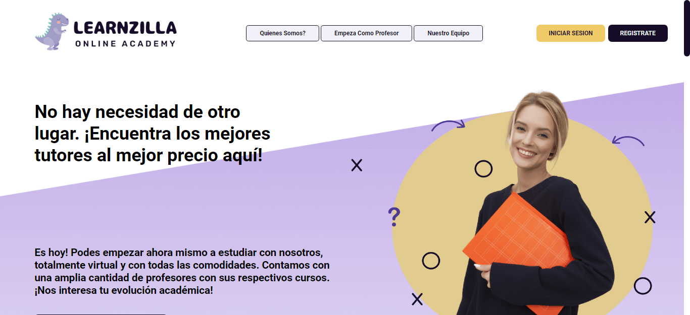

# Learnzilla - Academia Online

Hola, bienvenidos al repositorio de nuestro proyecto final para el Bootcamp Henry.

## Comenzando 🚀

Hemos desarrollado Learnzilla, una plataforma web para cursos online, la cual te permite registrarte como docente o como estudiante, crear y vender cursos (docente) así como comprar y ver cursos (estudiante). La app también cuenta con un panel de administrador para poder gestionar toda la página.

## Despliegue 📦

App Principal: [Learnzilla - Academia Online](https://learnzilla-app.vercel.app/)

Panel de administración: [Learnzilla - Administrador](https://learnzilla-admin-app.vercel.app/)

Repo para carga de Archivos: [Acá](https://github.com/dbriceno10/learnzilla-uploadvideos)

## Construido con 🛠️

Las tecnologías utilizadas fueron: HTML, CSS, JavaScript, React JS, Redux, Node JS, Express, Multer, PostgreSQL, Sequelize y Git, además de una pasarela de pago con Stripe.

---
⌨️ con ❤️ por [dbriceno10](https://github.com/dbriceno10), [SamuelCantos](https://github.com/SamuelCantos), [Marcem55](https://github.com/Marcem55), [David-j787](https://github.com/David-j787), [Nestoralons](https://github.com/Nestoralons), [rominaace44](https://github.com/rominaace44), [santiherr32](https://github.com/santiherr32) y [AlejoMl1](https://github.com/AlejoMl1) 😊
